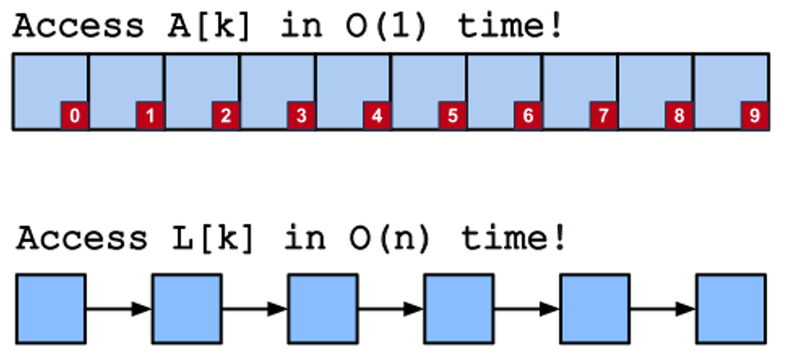

# 연결 리스트(Linked List)

연결 리스트는 배열(파이썬에서 리스트)과 더불어 CS에서 가장 기본이 되는 대표적인 선형 자료구조 중 하나이다. 배열의 경우 메모리의 공간을 할당받아 데이터를 저장하는 반면, 연결 리스트는 메모리에 데이터의 순서가 물리적인 순서대로 저장되지 않는다는 특징이 있다.

    

    (출처 - 스파르타코딩클럽)

배열은 데이터에 접근하는 방법은 쉬우나 데이터를 삽입할 때에는 많은 비용이 든다는 단점이 있다. 반면, 연결 리스트는 개발자가 직접 구현하여야 하는 자료구조로 데이터에 접근하는 방법은 어려울 수 있으나, 데이터를 삽입할 때에는 리스트에 비해 훨씬 적은 비용이 든다는 장점이 있다.

예를 들어, 배열의 원소를 조회할 때 인덱싱을 사용할 수 있으므로 시간 복잡도는 O(1)이나, 데이터를 첫 번째 또는 중간에 삽입하는 경우에는 모든 데이터를 뒤로 한 칸씩 이동시켜야 하므로 시간 복잡도는 O(N)이다. 반면, 연결 리스트로 데이터를 조회할 때 원하는 값을 찾을 때까지 연결 리스트의 모든 노드를 비교하여야 하므로 시간 복잡도는 O(N)이나, 데이터를 첫 번째 또는 중간에 삽입하는 경우에는 노드의 연결 나타내는 포인터만 변경하면 되므로 시간 복잡도는 O(1)이다.

따라서, 데이터 조회 등 데이터에 접근하는 경우가 빈번한 경우에는 배열을 사용하는 것이 효율적이고, 데이터 삽입 또는 삭제가 빈번하게 발생하는 경우에는 연결 리스트를 사용하는 것이 효율적이라고 할 수 있다.

# 문제

## LeeCode

### 021. Merge Two Sorted Lists

- [문제내용](https://leetcode.com/problems/merge-two-sorted-lists/)
- [문제풀이](https://choewy.tistory.com/126)

### 206. Reverse Linked List

- [문제내용]((https://leetcode.com/problems/reverse-linked-list/)
- [문제풀이](https://choewy.tistory.com/127)

### 234. Palindrome Linked List

- [문제내용](https://leetcode.com/problems/palindrome-linked-list/)
- 문제풀이 : 작성필요

연결 리스트의 `head`가 입력으로 주어지며, 해당 연결 리스트가 팰린드롬인 경우 `True`를 아닐 경우는 `False`를 반환하여야 한다.

### 328. Odd Even Linked List

- [문제내용]((https://leetcode.com/problems/odd-even-linked-list/)
- 문제풀이 : 작성필요

연결 리스트의 head가 주어진다. 홀수 인덱스의 모든 노드를 그룹화하고, 짝수 인덱스의 모든 노드를 그룹화하되 각각 그룹 내부의 상대적 순서는 입력에서와 동일하게 유지되도록 정렬된 연결 리스트를 반환하여야 한다. 이때, 첫 번째 노드의 인덱스는 홀수이며, 공간 복잡도 O(1)과 시간 복잡도 O(n)을 충족시켜야 한다.

