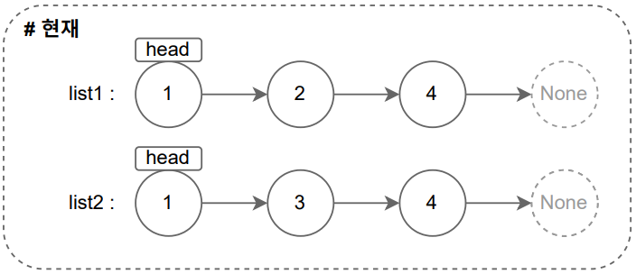
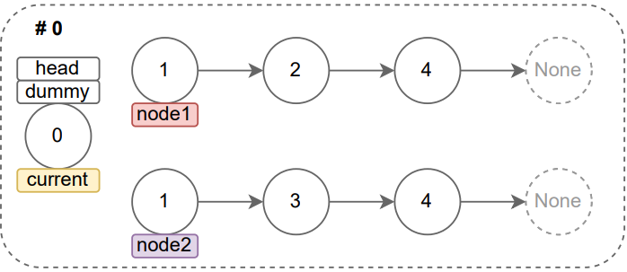
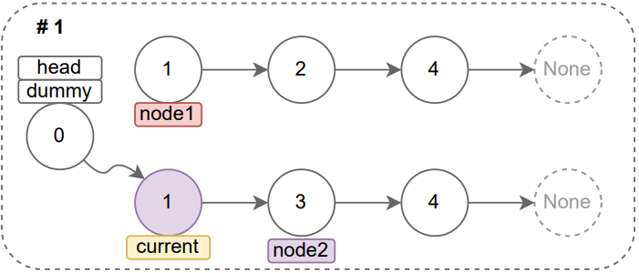
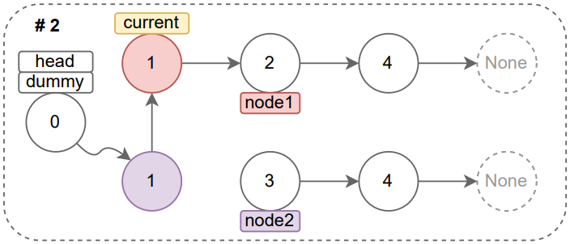
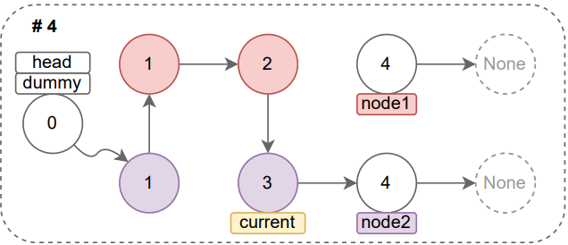
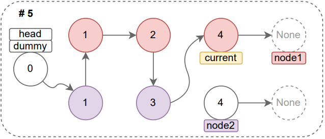
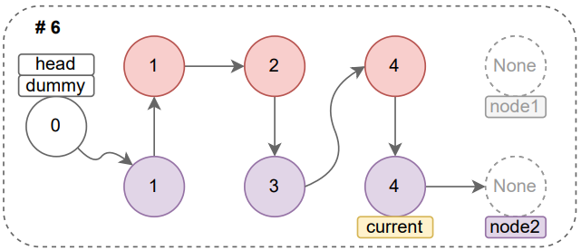
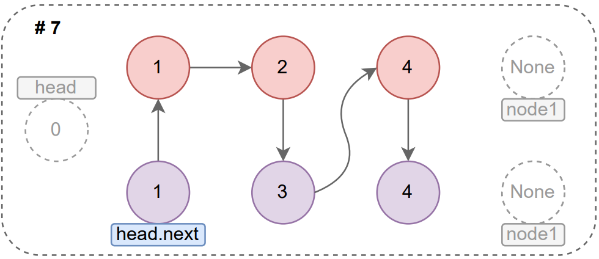

# leetcode

## ✔ [21. Merge Two Sorted Lists](https://leetcode.com/problems/merge-two-sorted-lists/)

### 내용

정렬된 두 개의 연결 리스트의 노드를 결합하여 다음 그림과 같이 하나의 정렬된 연결 리스트로 병합하여야 한다.

문제에서 주어진 예시(`list1 = [1, 2, 4]`, `list2 = [1, 3, 4]`)를 그림으로 나타내면 다음과 같다.



이 둘은 노드의 값을 기준으로 오름차순으로 정렬되어 있으며, 가장 왼쪽에 있는 노드가 각 연결 리스트의 head라고 할 수 있다. 그렇다면, 임시 노드를 생성하여 head로 정해놓고, 주어진 연결 리스트 2개의 노드 값을 비교한 결과에 따라 임시 노드 뒤에 연결시키면 되지 않을까라는 생각으로 문제에 접근하였다. 이를 그림과 설명으로 나타내보면 다음과 같다.

#### 0. 새로운 연결 리스트의 head가 되어줄 Dummy 노드를 생성한다(이 리스트의 현재 노드의 포인터를 current라고 명명하였다).

<div align="center">
    
</div>

#### 1. 입력받은 list1와 list2의 포인터를 각각 node1, node2로 하고, 값을 비교한다. 값이 동일하므로 `current`의 다음 포인터(`current.next`)를 node2의 위치로 변경하고, `node2`의 포인터는 자식 노드(`node2.next`)를 가리키도록 변경한다(이어서 node1과 node2의 값 비교 -> 결과 2번 그림).

<div align="center">
    
</div>

#### 2. node1에 위치한 노드의 값이 더 작으므로 `current`의 다음 포인터(`current.next`)를 node1의 위치로 변경하고, `node1`의 포인터는 자식 노드(`node1.next`)를 가리키도록 변경한다(이어서 node1과 node2의 값 비교 -> 결과 3번 그림).

<div align="center">
    
</div>

#### 3. node1에 위치한 노드의 값이 더 작으므로 `current`의 다음 포인터(`current.next`)를 node1의 위치로 변경하고, `node1`의 포인터는 자식 노드(`node1.next`)를 가리키도록 변경한다(이어서 node1과 node2의 값 비교 -> 결과 4번 그림).

<div align="center">
    
</div>

#### 4. node2에 위치한 노드의 값이 더 작으므로 `current`의 다음 포인터(`current.next`)를 node2의 위치로 변경하고, `node2`의 포인터는 자식 노드(`node2.next`)를 가리키도록 변경한다(이어서 node1과 node2의 값 비교 -> 결과 5번 그림).

<div align="center">
    
</div>

#### 5. node1과 node2에 위치한 노드의 값이 동일하므로 `current`의 다음 포인터(`current.next`)를 node1의 위치로 변경하고, `node1`의 포인터는 자식 노드(`node2.next`)를 가리키도록 변경한다(이어서 node1과 node2의 값 비교 -> node1에 위치한 노드가 존재하지 않으므로 반복 종료).

<div align="center">
    
</div>

본 내용은 leetcode에서 제공한 아래 그림을 토대로 작성하였기 때문에 `그림 1`(node2로 이동), `그림 5`(node1로 이동)와 같이 값이 동일한 경우 포인터를 어디로 변경할 것인지 헷갈릴 수 있다. 결론만 말하자면, 두 개의 노드 값이 동일한 경우 node1, node2 중 아무거나 선택해도 무방하다.
 
<div align="center">
    
</div>

#### 6. node2에 위치한 노드만 존재하므로 `current`의 다음 포인터(`current.next`)를 node2의 위치로 변경하고, `node2`의 포인터는 자식 노드(`node2.next`)를 가리키도록 변경한다.

<div align="center">
    
</div>

#### 7. 새롭게 재구성된 연결 리스트에서 head는 제외힌 싱테러 반환하여야 하므로, `head`의 자식 노드(head.next)를 최종 결과로 반환한다.

<div align="center">
    
</div>

### 참고자료

- [코딩 테스트, 정렬된 리스트 합치기](https://www.youtube.com/watch?v=kYzjk6xYAYg)

## ✔ [234. Palindrome Linked List](https://leetcode.com/problems/palindrome-linked-list/)

### 내용

연결 리스트의 `head`가 입력으로 주어지며, 해당 연결 리스트가 팰린드롬인 경우 `True`를 아닐 경우는 `False`를 반환하여야 한다.

## ✔ [206. Reverse Linked List](https://leetcode.com/problems/reverse-linked-list/)

### 내용

연결 리스트의 `head`가 주어지며, 이를 역순으로 재구성한 후 반환하여야 한다.

이 문제는 위의 [21. Merge Two Sorted Lists](/#-21-merge-two-sorted-lists)와 같이 새로운 노드를 생성하는 방식으로 해결하는데, 문제에서 주어진 예시로 과정을 나타내보면 다음과 같다.

> ```
> input : [1, 2, 3, 4, 5]
> output : [5, 4, 3, 2, 1]
> ```

#### 1. 현재 노드(`current`)를 연결 리스트의 `head`로 정하고, 새로운 노드(`node`)를 None으로 초기화한다.

```python
current, node = head, None
```

#### 2. 현재 노드 즉, 기존 연결 리스트의 head가 되는 모든 노드를 탐색하며 새로운 노드로 값을 넘겨준다. 이 과정을 다음과 같이 나타낼 수 있다.

- **첫 번째 실행 과정**

```
current: ListNode: [1 -> 2 -> 3 -> 4 -> 5]
            
1) next = ListNode: [2 -> 3 -> 4 -> 5]
2) current.next = None
3) node = ListNode: [1]
4) current = ListNode: [2 -> 3 -> 4 -> 5]
```

- **두 번째 실행 과정**

```
current: ListNode: [2 -> 3 -> 4 -> 5]

1) next = ListNode: [3 -> 4 -> 5]
2) current.next = ListNode: [1]
3) node = ListNode: [2 -> 1]
4) current = ListNode: [3 -> 4 -> 5]
```

- **세 번째 실행 과정**

```
current: ListNode: [3 -> 4 -> 5]

1) next = ListNode: [4 -> 5]
2) current.next = ListNode: [2 -> 1]
3) node = ListNode: [3 -> 2 -> 1]
4) current = ListNode: [4 -> 5]
```

- **네 번째 실행 과정**

```
current: ListNode: [4 -> 5]

1) next = ListNode: [5]
2) current.next = ListNode: [3 -> 2 -> 1]
3) node = ListNode: [4 -> 3 -> 2 -> 1]
4) current = ListNode: [5]
```

- **다섯 번째 실행 과정**

```
current: ListNode: [5]
            
1) next = None
2) current.next = ListNode: [4 -> 3 -> 2 -> 1]
3) node = ListNode: [5 -> 4 -> 3 -> 2 -> 1]
4) current = ListNode: None
```

- **여섯 번째 실행 과정**

```
current : None

반복 종료
```

#### 3. 새롭게 구성된 node를 반환한다.

```python
return node
```

## [328. Odd Even Linked List](https://leetcode.com/problems/odd-even-linked-list/)

연결 리스트의 head가 주어진다. 홀수 인덱스의 모든 노드를 그룹화하고, 짝수 인덱스의 모든 노드를 그룹화하되 각각 그룹 내부의 상대적 순서는 입력에서와 동일하게 유지되도록 정렬된 연결 리스트를 반환하여야 한다. 이때, 첫 번째 노드의 인덱스는 홀수이며, 공간 복잡도 O(1)과 시간 복잡도 O(n)을 충족시켜야 한다.


