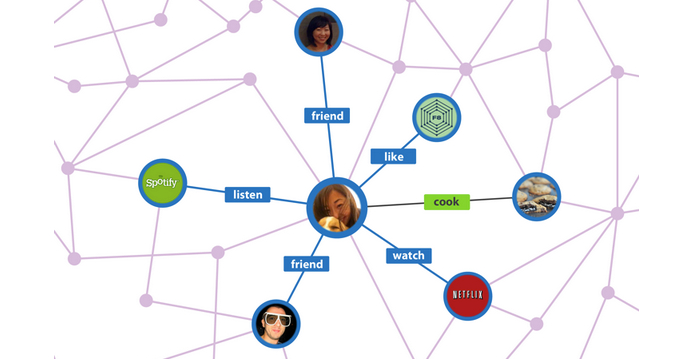

# 그래프

그래프는 연결되어 있는 정점과 정점간의 관계를 표현할 수 있는 자료구조이다.

자료구조는 크게 선형구조, 비선형구조로 구분된다. 선형구조는 자료를 저장하고 꺼내는 것에 초점이 맞춰져 있는 반면, 비선형구조는 표현에 초점이 맞춰져있다. 그래프는 표현에 초점이 맞춰져있다.

    

그래프의 연결 관계를 가진 각 데이터를 노드(Node)라고 하며, 정점(Vertex)이라고도 한다. 그리고, 노드 간의 관계를 나타낸 선을 간선(Edge)이라고 하며, 간선으로 직접 연결된 노드를 인접 노드(Adjacent Node)라고 한다.

또한, 그래프는 유방향 그래프와 무방향 그래프로 구분된다. 유방향 그래프(Directed Graph)는 방향이 있는 간선을 갖으며, 간선은 단방향 관계를 나타내므로 한 방향으로만 진행할 수 있다. 무방향 그래프(Undirected Graph)는 방향이 없는 간선을 갖는다.